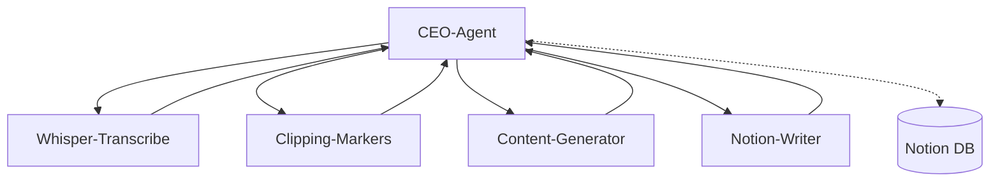

# Agenten-Framework für n8n

Dieses Framework orchestriert Medienverarbeitung mit einem CEO-Agenten und Sub-Agenten in n8n. Die Flows sind modular, CI/CD-fähig und können einfach erweitert werden.

## Struktur
- flows/: Enthält alle n8n-Flow-JSONs
- schemas/: Input/Output-Schemas für Validierung
- env/: Beispiel-Umgebungsvariablen
- prompts/: System-Prompts für LLM-Nodes
- examples/: Beispiel-Payloads für Tests

## Trigger & Ablauf
- CEO-Agent (00_ceo_agent) startet per HTTP-POST /agents/ingest
- Validiert Input gegen input.schema.json
- Entscheidet, welche Sub-Flows ausgeführt werden
- Sub-Flows: Whisper-Transcribe, Clipping-Markers, Content-Generator, Notion-Writer
- Outputs werden konsolidiert und in Notion geschrieben

## Inputs/Outputs
- Input: Siehe schemas/input.schema.json
- Output: Siehe schemas/output.schema.json
- Notion: Siehe schemas/notion_page.schema.json

## Secrets & Env
- Alle Secrets via n8n-Credentials oder .env (env/.env.example)

## Tests
- Beispiel-Payload: examples/ingest_sample.json
- End-to-End-Test: curl-Command im README

## CI/CD
- Flows als JSON im Repo, Import/Export via n8n API
- Lint-Job validiert JSON-Schemas

## Diagramm

## Weitere Infos
- Setup, Trigger, Variablen, Tests siehe README.md
- Keine Secrets im Repo
- Erweiterbar für Monitoring, Agenten, etc.
